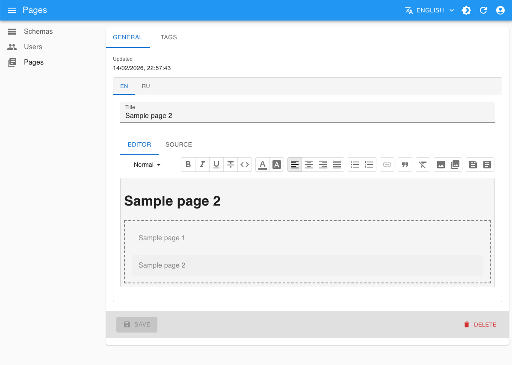

# ReactJS and NestJS - CMS

## Demo

[https://vzhyhunou.github.io/vzh-cms-2](https://vzhyhunou.github.io/vzh-cms-2)

## Features
- Customizable resource manager
- Object relational mapping
- REST API interaction
- Data querying
- Projections and transformations
- Reusable UI components
- Server-side XSS sanitization
- Authentication and authorization
- Internationalization
- Import and export resources

## Tech stack and libraries
### Backend
- NestJS
- TypeORM
- PassportJS
- nestjs-i18n
- cron
- moment
- bcrypt
- DOMPurify
### Frontend
- ReactJS
- React-admin
- React Router
- Material-UI
- ViteJS
- Jest

## Getting Started
### Running
- Download and install Node: https://nodejs.org/download/release/v20.19.5
- Checkout this repo or download and unzip https://github.com/vzhyhunou/vzh-cms-2/archive/refs/heads/master.zip
- Change current directory: `cd vzh-cms-2-master`
- Install packages: `npm install`
- Build app: `npm run build`
- Change current directory: `cd server`
- Start app: `node dist/main.js`
### Usage
- Home page: http://localhost:8090
- Admin console: http://localhost:8090/admin, use `admin`, `editor`, `manager` as username and password

## Configuration
### Datasource
- Update `datasource` properties in `config.js` according to your environment. See https://typeorm.io/docs/data-source/data-source-options
- Install appropriate database driver (e.g. `npm install mysql`). See https://typeorm.io/docs/drivers/mysql
### Import
- Create empty database
- Replace `resources.imp.path` property in `config.js` with existing filename (e.g. `storage/import/hello.zip`)
- Restart app
