# ReactJS and NestJS - CMS


Full-stack JavaScript customizable CMS, supports REST API and component-based UI.

## Demo
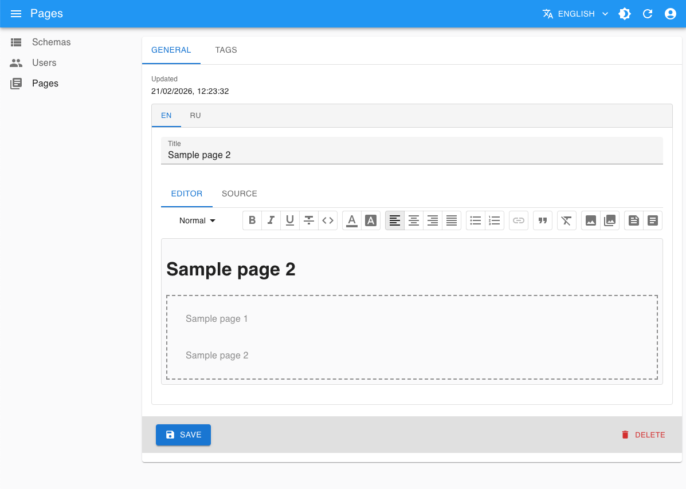
[https://vzhyhunou.github.io/vzh-cms-2](https://vzhyhunou.github.io/vzh-cms-2)

## Features
- Customizable resource manager
- Object relational mapping
- REST API interaction
- Data querying
- Projections and transformations
- Reusable UI components
- Server-side XSS sanitization
- Authentication and authorization
- Internationalization
- Import and export resources

## Tech Stack
### Backend
- NestJS
- TypeORM
- PassportJS
- nestjs-i18n
- cron
- moment
- bcrypt
- DOMPurify
### Frontend
- ReactJS
- React-admin
- React Router
- Material-UI
- ViteJS
- Jest

## Getting Started
### Running
- Download and install Node: https://nodejs.org/download/release/v20.19.5
- Checkout this repo or download and unzip https://github.com/vzhyhunou/vzh-cms-2/archive/refs/heads/master.zip
- Change current directory: `cd vzh-cms-2-master`
- Install packages: `npm install`
- Build app: `npm run build`
- Change current directory: `cd server`
- Start app: `node dist/main.js`
### Usage
- Home page: http://localhost:8090
- Admin console: http://localhost:8090/admin, use `admin`, `editor`, `manager` as username and password

## Configuration
### Datasource
- Update `datasource` properties in `config.js` according to your environment. See https://typeorm.io/docs/data-source/data-source-options
- Install appropriate database driver (e.g. `npm install mysql`). See https://typeorm.io/docs/drivers/mysql
### Import
- Create empty database
- Replace `resources.imp.path` property in `config.js` with existing filename (e.g. `storage/import/hello.zip`)
- Restart app

## Hello World
This explains how to create your own schemas from scratch step by step.
Also you can import `storage/import/hello.zip` to see expected result.
### Preparation
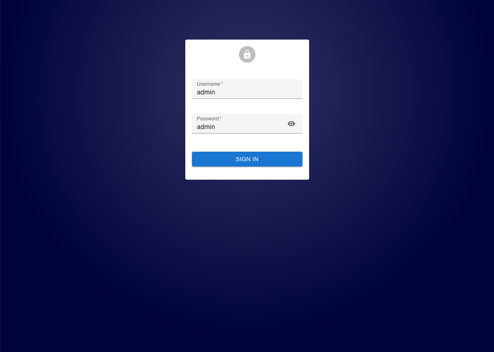
- Replace `resources.imp.path` property in `config.js` with `storage/import/empty.zip`
- Restart app
- Open page: http://localhost:8090
- Use `admin` as username and password
### Create Schema
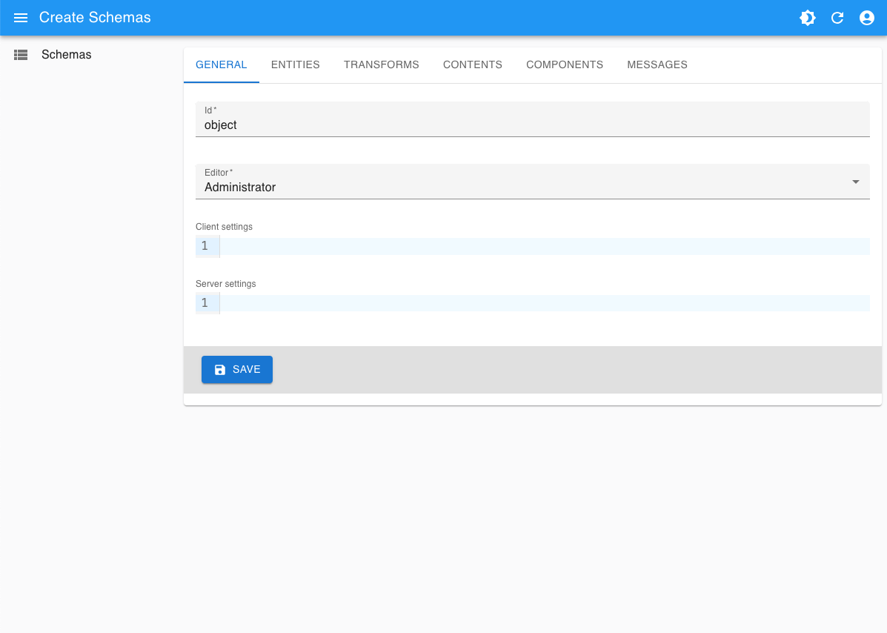
- Select Schemas menu item
- Click Create button
- Select General tab
- Input `object` as Id
- Select `Administrator` as Editor
#### Create Entity
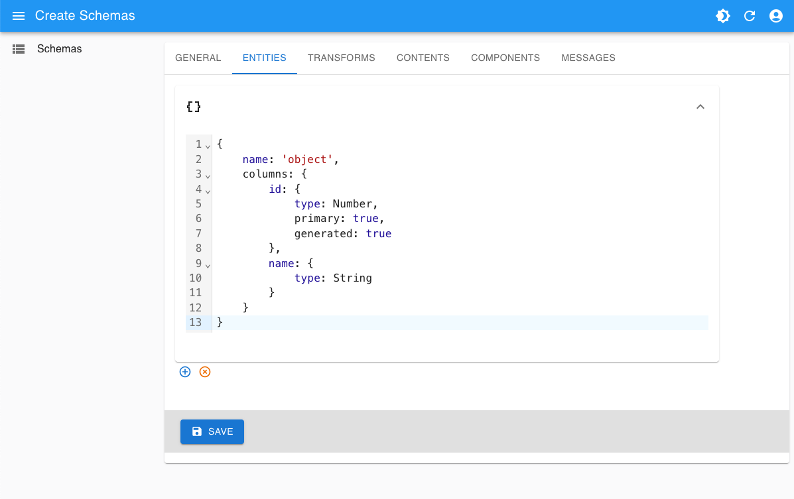
- Select Entities tab
- Add then pull down new combo
- Input next code
```javascript
{
    name: 'object',
    columns: {
        id: {
            type: Number,
            primary: true,
            generated: true
        },
        name: {
            type: String
        }
    }
}
```
See [https://typeorm.io/docs/entity/separating-entity-definition](https://typeorm.io/docs/entity/separating-entity-definition) for further information
#### Create Admin Components
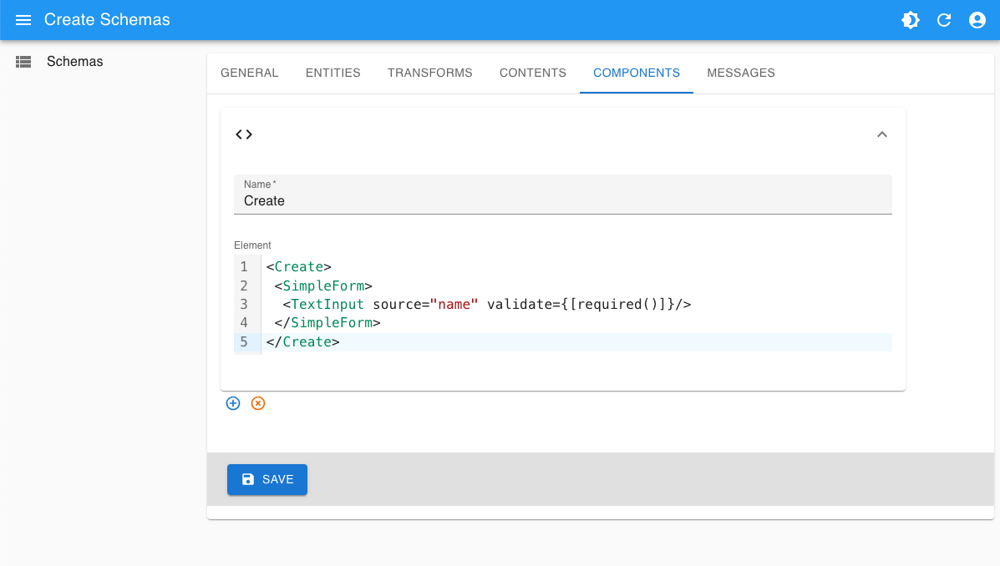
- Select Components tab
- Add then pull down new combo
- Input `Create` as Name
- Input next code as Element
```jsx
<Create>
 <SimpleForm>
  <TextInput source="name" validate={[required()]}/>
 </SimpleForm>
</Create>
```
- Add then pull down new combo
- Input `Edit` as Name
- Input next code as Element
```jsx
<Edit>
 <SimpleForm>
  <TextInput source="name" validate={[required()]}/>
 </SimpleForm>
</Edit>
```
- Add then pull down new combo
- Input `List` as Name
- Input next code as Element
```jsx
<List exporter={false}>
 <Datagrid rowClick={false}>
  <TextField source="id"/>
  <TextField source="name"/>
  <EditButton/>
 </Datagrid>
</List>
```
- Click Save button
- Reload page, notice new Objects menu item along with Schemas

See [https://marmelab.com/react-admin/documentation.html](https://marmelab.com/react-admin/documentation.html) for further information
### Create Data Instances
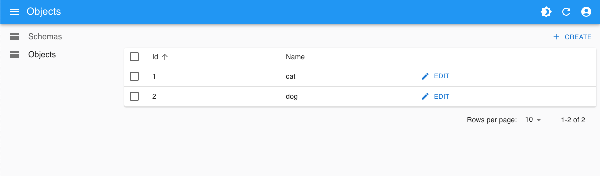
- Select Objects menu item
- Click Create button
- Input `cat` as Name
- Click Save button
- Select Objects menu item, notice new object
- Click Create button
- Input `dog` as Name
- Click Save button
- Select Objects menu item, notice another object
### Data Querying
#### Create Multiple Result Query
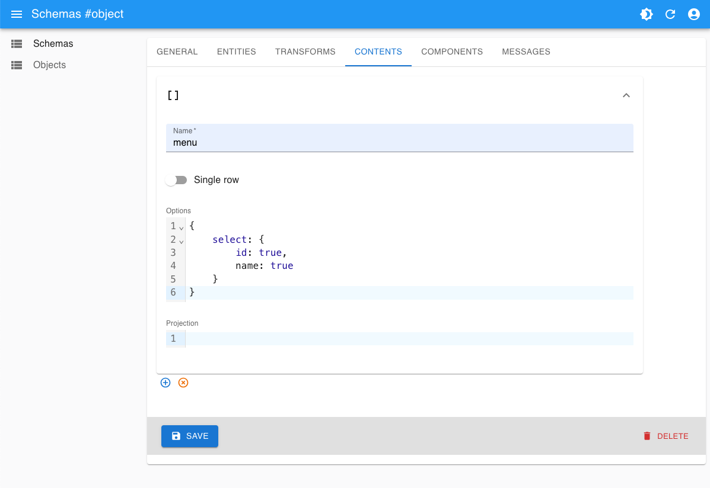
- Select Schemas menu item
- Click Edit button for 'object' row
- Select Contents tab
- Add then pull down new combo
- Input `menu` as Name
- Input next code as Options
```javascript
{
    select: {
        id: true,
        name: true
    }
}
```
- Click Save button
- At the moment you are able to fetch data by HTTP request
```console
# curl "localhost:8090/api/content/object/menu"
[
  {
    "id": 1,
    "name": "cat"
  },
  {
    "id": 2,
    "name": "dog"
  }
]
```
#### Create Single Result Query
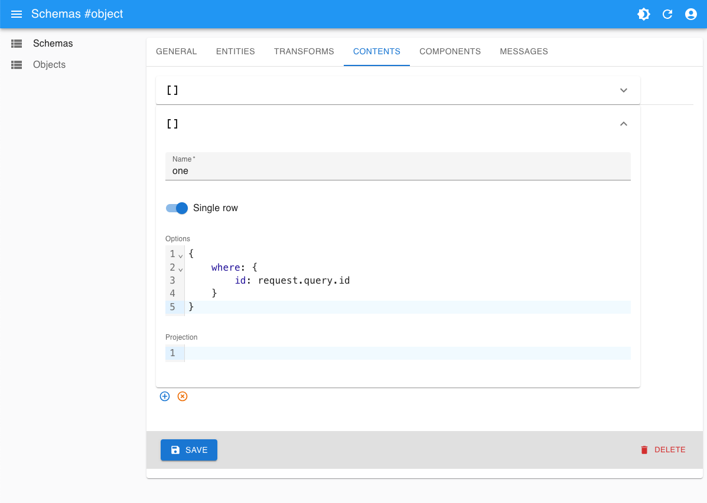
- Select Schemas menu item
- Click Edit button for 'object' row
- Select Contents tab
- Add then pull down new combo
- Input `one` as Name
- Turn 'Single row' switch on
- Input next code as Options
```javascript
{
    where: {
        id: request.query.id
    }
}
```
- Click Save button
- At the moment you are able to fetch data by HTTP request
```console
# curl "localhost:8090/api/content/object/one?id=1"
{
  "id": 1,
  "name": "cat"
}
```
See [https://typeorm.io/docs/working-with-entity-manager/find-options](https://typeorm.io/docs/working-with-entity-manager/find-options) for further information
### Create Home Page
#### Create Page Components
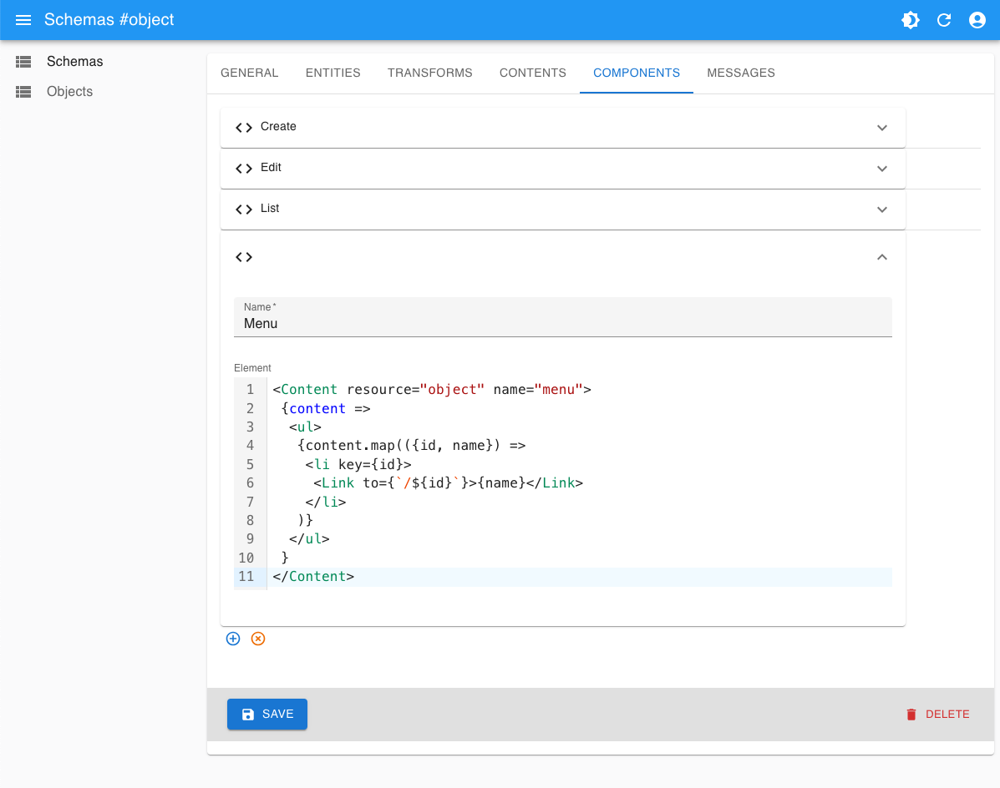
- Select Schemas menu item
- Click Edit button for 'object' row
- Select Components tab
- Add then pull down new combo
- Input `Menu` as Name
- Input next code as Element
```jsx
<Content resource="object" name="menu">
 {content =>
  <ul>
   {content.map(({id, name}) =>
    <li key={id}>
     <Link to={`/${id}`}>{name}</Link>
    </li>
   )}
  </ul>
 }
</Content>
```
- Add then pull down new combo
- Input `Header` as Name
- Input next code as Element
```jsx
<Content resource="object" name="one" id={props.id}>
 {({name}) =>
  <h1>Hello {name}</h1>
 }
</Content>
```
- Add then pull down new combo
- Input `Home` as Name
- Input next code as Element
```jsx
<div style={{padding: 50}}>
 {props.id ? <Component resource="object" name="Header" id={props.id}/> : <h1>Hello world</h1>}
 <Component resource="object" name="Menu"/>
</div>
```
- Click Save button
#### Update Routing
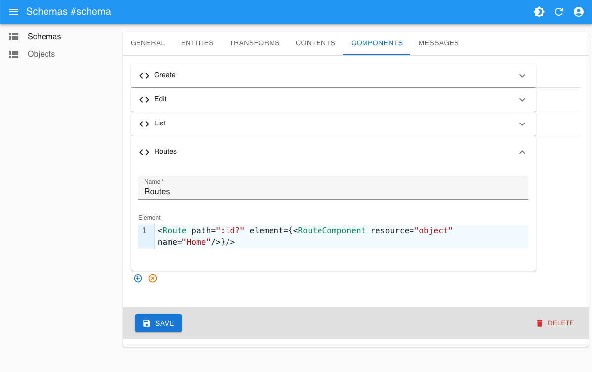
- Select Schemas menu item
- Click Edit button for 'schema' row
- Select Components tab
- Pull down Routes combo
- Update Element with next code
```jsx
<Route path=":id?" element={<RouteComponent resource="object" name="Home"/>}/>
```
- Click Save button

See [https://reactrouter.com/api/components/Route](https://reactrouter.com/api/components/Route) for further information
#### Check result
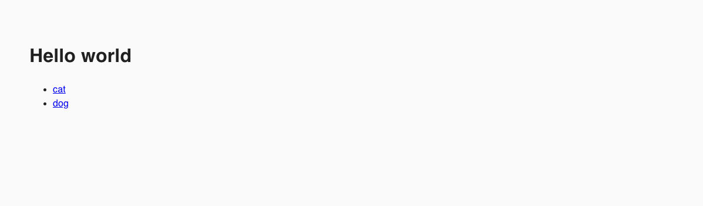
- Open page: http://localhost:8090
- Click any link to update content